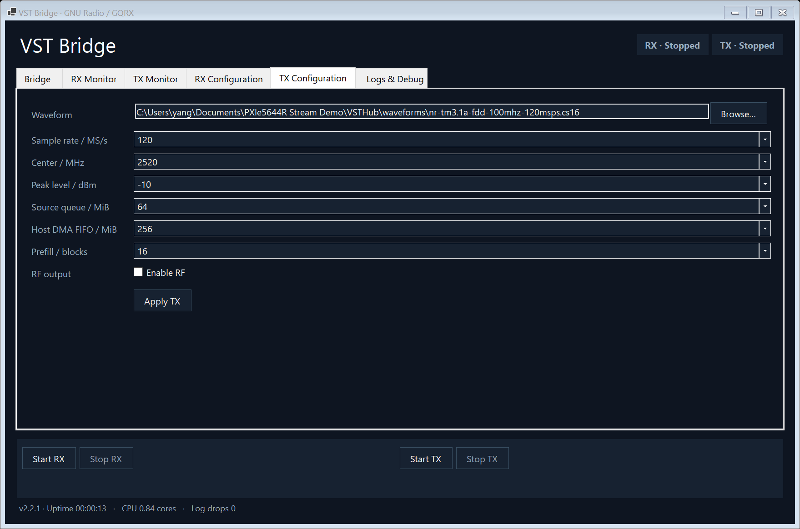
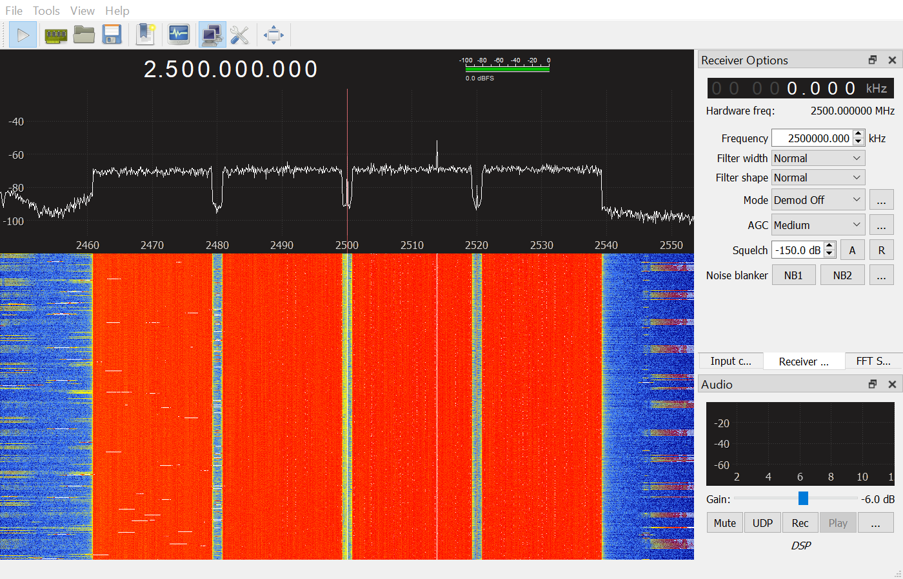

# VST Bridge

[简体中文](README.zh-CN.md)

[Download VST Bridge v2.2.1](https://github.com/DynamixYANG/vst-sdr-bridge/releases/tag/v2.2.1) · Public source repository. Application, standalone Soapy plugin, tagged source and SHA-256 checksums are published.

**NI VST ↔ GNU Radio / GQRX middleware for Windows.**

VST Bridge owns the NI RFSA/RFSG/FPGA session and connects the PXIe-5644R to open SDR applications through a native SoapySDR plugin. Configure the radio, launch either application, run RX or TX independently, monitor every transport stage, and inspect structured logs in one desktop console.

The product display name is **VST Bridge**. `VSTHub.exe`, `driver=vst`, the control API and shared-memory names remain compatible with VST Hub 2.0. GQRX is an RX client; GNU Radio supports RX, TX and duplex workflows. Exactly one IQ RX consumer may attach at a time.

Version **2.2.1** keeps RX/TX Start/Stop permanently visible in the window footer, applies dark backgrounds and white text to editable dropdowns and their lists, adds independent header status badges, replaces inline notes with hover help, fixes monitor spacing, and exposes initialization stages in Logs & Debug.

Patch 2.2.1 separates device initialization from RX acquisition, removes unfocused blue selection from editable configuration fields, and keeps disabled fields dark. See [patch validation](docs/VALIDATION-2.2.1.md).

## License

Project-owned Hub, plugin and supporting code use [GNU GPL v3 or later](LICENSE) (`GPL-3.0-or-later`). Hobby and commercial use are permitted; conveying binaries or modifications requires compliance with GPL terms, including Corresponding Source. A [limited NI driver linking permission](LICENSE-EXCEPTIONS.md) supports the required proprietary hardware libraries. Existing third-party licenses remain applicable. See [licensing scope](docs/LICENSING.md), [NOTICE](NOTICE) and [third-party notices](THIRD-PARTY-NOTICES.md).

## Features

| Function | Implementation |
|---|---|
| Application launcher | GQRX and GNU Radio Companion; configurable executable paths and launch arguments |
| RX | 1–120 MS/s, 65 MHz–6 GHz, reference level −50…+30 dBm, automatic preamplifier |
| TX | 1–120 MS/s, independent center and peak level −50…0 dBm, explicit RF enable |
| Duplex | Separate RX/TX workers and DMA FIFOs sharing one device session |
| File playback | Direct TDMS I/Q or CS16 + SHA-256 JSON metadata, repeating preloaded IQ |
| Live TX | Native SoapySDR `writeStream`, CF32/CS16, bounded shared-memory queue |
| Monitoring | Source, DMA and client rates, queue reserve, FIFO state, heartbeats, loss, underflow and recovery counters |
| Debug | Live events, JSON snapshot export, loopback control API, rotating UTC JSONL files |
| Deployment | Self-contained Windows x64 executable embedding the matching native plugin |

120 MS/s describes complex IQ sample rate. It is 480 MB/s / 3.84 Gbit/s for CS16 per direction, or 960 MB/s / 7.68 Gbit/s for CF32. The 5644R nominal RF bandwidth is approximately 80 MHz; it is not a 120 MHz flat RF passband.

## Requirements

Runtime: Windows x64, NI PXIe-5644R, NI-RFSA/RFSG and NI-RIO/FPGA support, the matching NI Streaming for VST bitfile, and radioconda x64 with SoapySDR 0.8 plus GNU Radio or GQRX as needed. The EXE bundles .NET; native TX file playback needs no Python bridge or LabVIEW.

Source builds additionally need .NET 10 SDK, MSVC/Windows SDK, CMake/Ninja and NI headers/import libraries. Generation/tests use the pinned [requirements-dev.txt](requirements-dev.txt). Exact observed versions, installed paths and the external-file audit are in [docs/REQUIREMENTS.md](docs/REQUIREMENTS.md).

TX assets are consolidated in `waveform/`. The NI bitfile is archived locally under `hardware/ni-pxie-5644r/local/`, with provenance and original terms alongside it. Run `scripts/Import-NiBitfile.ps1` and `scripts/Set-ProjectAssets.ps1` with the Hub closed. The vendor-installed bitfile remains required by current RFSA/RFSG initialization; the local vendor binary is excluded from this public repository and public packages.

These paths/tools describe the current source checkout. Existing v2.2.1 release ZIPs retain their original `waveforms/` layout and tested binaries; use that path when running an unchanged release archive.

## Quick start

1. Install NI-RFSA, NI-RIO/FPGA support, NI Streaming for VST bitfile and radioconda with GNU Radio / GQRX / SoapySDR 0.8, all x64.
2. Start `dist/VSTHub/VSTHub.exe` in the source tree, or `VSTHub.exe` in the extracted release package. The Bridge initializes the shared device session and verifies its embedded Soapy plugin. RX and TX remain stopped. Click Start RX, or activate RX DSP in an attached Soapy client, to begin acquisition.
3. Set center, sample rate and reference level on **RX Configuration**, then **Apply RX**.
4. On **Bridge**, choose **Launch GQRX** or **Launch GNU Radio**. GQRX device string: `soapy=0,driver=vst,resource=RIO0`. Soapy/GNU Radio device arguments: `driver=vst,resource=RIO0`.
5. Match the application's input rate to the Bridge rate. Enable GQRX DSP, or run a GNU Radio flowgraph.
6. For file TX, select `waveform/nr-tm3.1a-fdd-4x20mhz-120msps.tdms` on **TX Configuration**, set center/peak, explicitly enable RF and click **Start TX**. RX may remain running or be stopped.
7. Stop each direction independently. **Stop TX** stops file or live TX; close the producer flowgraph before restarting live TX.

GQRX and GNU Radio may both be open. Only one can receive IQ; a TX-only GNU Radio flowgraph can coexist with GQRX RX. Stop TX before changing the shared IQ clock or resizing device buffers.

## Examples

* [GNU Radio 120 MS/s duplex](examples/grc/README.md): editable GRC flowgraph plus generated Python; precomputed +1 MHz tone, real RX spectrum and waterfall. The antenna test variant explicitly enables RF at −10 dBm peak and sets RX reference to −20 dBm.
* [TDMS playback](docs/TDMS.md): native reader, accepted metadata/types and reproducible four-carrier DL FDD TM3.1a stimulus.
* [Control API](docs/CONTROL-API.md): script independent RX/TX starts, stops, tuning and status without taking an IQ consumer slot.

## Architecture

```text
RF IN → NI FPGA RX DMA → C# Hub → RX shared memory → C++ SoapySDR → GQRX / GNU Radio
GNU Radio → C++ Soapy writeStream → TX shared memory ┐
TDMS / CS16 → validate and preload IQ ───────────────┴→ bounded queue → TX DMA → RF OUT
```

There is one RFSA/RFSG/FPGA session owner. File parsing happens before RF starts; steady playback uses preallocated memory and bounded queues. Backpressure never overwrites TX samples. A missing TX client transitions to **No client data** with RF off. Hardware faults remain errors and require explicit restart. TX queue/FIFO sizes are editable; Apply TX saves their defaults for the next live client start. [Implementation details](docs/ARCHITECTURE.md).

## Project layout

| Directory | Contents |
|---|---|
| `src/` | C# hardware/control core and Windows desktop application |
| `soapy-vst/` | C++ SoapySDR RX/TX plugin and GRC block definition |
| `gr-vst/` | Optional Python blocks; legacy direct-Fetch RX is clearly marked |
| `examples/` | Editable application examples and launch instructions |
| `hardware/` | NI bitfile provenance/import tools and local vendor archive |
| `waveform/` | Reproducible TDMS/CS16 stimuli, metadata and provenance |
| `scripts/` | Native build, waveform generation and release tooling |
| `tests/` | Maintained regression/acceptance tests and current evidence |
| `docs/` | Architecture, API, handoff, validation and release notes |
| `dist/` | Current compiled executable; binaries are distributed as Release assets |
| `archive/` | Preserved old experiments, outputs and handoffs; excluded from Git |
| `work/`, `tools/` | Local scratch and build dependencies; excluded from Git except indexes |

## Build and validation

```powershell
.\build.ps1 -SelfTest
# Reuse an already built native module:
.\build.ps1 -SkipSoapy -SelfTest
```

Build requires .NET 10 SDK, MSVC x64, CMake/Ninja, NI headers/import libraries and radioconda. The published application needs NI drivers and the client software, but no separately installed .NET runtime or Python bridge. Tests and waveform generation use radioconda Python with NumPy/SciPy/npTDMS.

The current evidence and exact acceptance status are recorded in [docs/VALIDATION.md](docs/VALIDATION.md). The GRC golden run completed 1,200 seconds with full-rate delivery, zero stream errors and inspected spectrum evidence. TDMS/GQRX is separately marked USER_ACCEPTED at the operator's requested approximately 17-minute interval. Historical experiments and automatic failures remain preserved.

| Test | Duration / s | RX delivered / MS/s | TX processed / MS/s | Result |
|---|---:|---:|---:|---|
| GNU Radio normal main() | 1200.485 | 120.001120 | 120.001129 | PASS |
| TDMS + GQRX | 1026.875 | 120.001127 | 120.001130 | USER_ACCEPTED (~17 min) |

GNU Radio uses its ordinary generated-script main(), with zero stream errors in the full 20-minute run. TDMS/GQRX is accepted by the operator at approximately 17 minutes; the original interrupted automatic FAIL and spectrum-gate limitation are preserved. Actual application spectrum/waterfall images, hardware counters and precise limitations are in [VALIDATION.md](docs/VALIDATION.md).

The current 2.2.1 patch changes startup, native client activation and configuration-field rendering. It passes 39 self-checks and short real-device/native-client regressions; see [patch validation](docs/VALIDATION-2.2.1.md). Earlier long runs remain bound to their recorded 2.2 binaries.




## Runtime files

`%LOCALAPPDATA%\VSTHub` contains `settings.json`, atomic `status.json`, `gqrx.conf`, plugin backups and `logs/hub-*.jsonl`. Default log limits: 10 MiB/file, 10 files, 14 days. The control server binds only `127.0.0.1:19788`.

The reader accepts a documented TDMS IQ profile rather than every DAQmx layout. Waveform tests prove digital structure and antenna spectrum visibility; they do not certify EVM, ACLR or absolute RF power. NI driver/bitfile components and third-party application installers are not redistributed. See [THIRD-PARTY-NOTICES.md](THIRD-PARTY-NOTICES.md).
