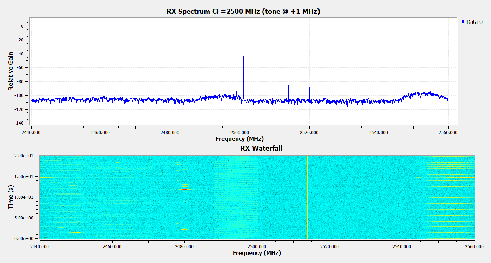
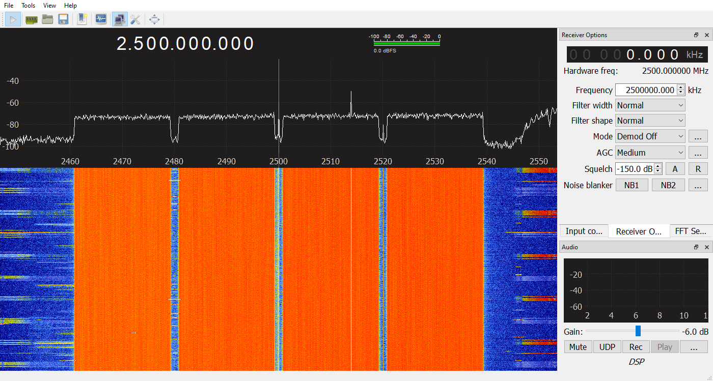

# Superseded 2.1 acceptance record

Manual GRC execution later reported TIMEOUT. These wrapper-based results do not establish ordinary-entrypoint repeatability; see VALIDATION.md for the corrected 2.2 run.

# VST Bridge 2.1 validation

Both golden examples completed continuous 20-minute hardware acceptance on 1 October 2026 (Europe/Helsinki). The GQRX spectrum result includes a documented post-run review of a narrowband interferer; original data and original FAIL classification are retained.

| Test | Duration (s) | RX DMA (MS/s) | RX client (MS/s) | TX (MS/s) | Result |
|---|---:|---:|---:|---:|---|
| GNU Radio duplex | 1200.718 | 120.039935 | 120.039062 | 119.991869 | PASS |
| TDMS playback + GQRX | 1200.000 | 120.013018 | 120.013018 | 120.012980 | PASS |

Both runs have zero TX underflows, RX active drops, display skips, FIFO overflow, recovery, dropped log records and logger errors. Every observed status reports RF on and an active RX consumer. Rates above are counter deltas over the full interval, not a screenshot's instantaneous readout. Idle-discard samples accumulated outside the active runs are not active data loss. One prior intentional control rejection comes from testing a forbidden shared-rate change while TX is running.

## Hardware and settings

NI PXIe-5644R RIO0, Windows x64, Intel i7-6700 (4 cores / 8 threads), NI RFSA/RFSG/FPGA streaming. Radioconda: GNU Radio 3.10.12.0, GQRX 2.17.6, SoapySDR 0.8.1, Qt 5.15, Python 3.12.9. Adjacent RF OUT / RF IN antennas as supplied by the operator; center 2500 MHz, complex IQ rate 120 MS/s, TX peak setting −10 dBm, RX reference −20 dBm, automatic preamplifier. These are instrument settings, not calibrated radiated-power measurements.

## Golden GNU Radio example

[Editable GRC and generated Python](../examples/grc/README.md). TX repeats a precomputed +1 MHz tone; RX drives actual Qt FFT and waterfall sinks. A 1,048,576-sample source buffer, 262,144-item scheduler blocks and elevated source/sink worker priority were necessary on this CPU. The settings are in the .grc and survive regeneration. There is no RX sample-rate decimation.

An independent read-only RX ring probe finds the tone at +996,093.75 Hz (FFT-bin resolution), approximately 67 dB above the median bin floor. The image shows the +1 MHz tone and continuous receive waterfall.

Raw evidence: [result](../tests/artifacts/grc-120-20min/result.json), [per-second monitor](../tests/artifacts/grc-120-20min/monitor.jsonl), [tone probe](../tests/artifacts/grc-120-20min/tone-rx-probe.json). The 1,205-second capture and final capture are actual widgets from the generated running flowgraph, not a synthesized plot.

## Golden native TDMS + GQRX example

The Hub opens `nr-tm3.1a-fdd-4x20mhz-120msps.tdms` directly through its C# reader and repeats preloaded I/Q through the bounded queue and TX DMA. GQRX consumes the full 120 MS/s RX stream throughout 1,200 seconds. FFT size 16,384, requested display rate 20 frames/s; 40 in-run window captures at 30-second intervals document display progression (a further capture was taken during shutdown).

Four 20 MHz nominal channels centered at offsets −30, −10, +10 and +30 MHz are visible with the expected guard gaps. Each uses a 51-PRB, 30 kHz SCS, DL FDD TM3.1a 256QAM reference grid. Occupied width is 18.36 MHz per carrier; aggregate outer occupied edges are ±39.18 MHz. The four signals are time/phase shifted copies of the pinned reference. This verifies transport and spectrum visibility, not certified EVM/ACLR or PN23 conformance.

The initial arithmetic band-power ON/OFF check required >10 dB per carrier and reported 5.82 dB for carrier 3: an external persistent narrow tone near 2514 MHz dominates that band's OFF power. The actual waterfall still clearly shows all four wideband channels. After inspecting the original ON/OFF IQ-derived spectra, the review uses two requirements across each carrier's central 16 MHz: median ON/OFF improvement >10 dB and at least 95% of bins improved >10 dB. No bins, including the interferer, are removed.

| Offset (MHz) | Median ON/OFF (dB) | Bins improved >10 dB |
|---:|---:|---:|
| −30 | 25.581 | 99.817% |
| −10 | 23.888 | 100.000% |
| +10 | 28.449 | 99.542% |
| +30 | 28.403 | 100.000% |

This criterion correction occurred after acquisition and is disclosed here. The original [FAIL result](../tests/artifacts/gqrx-tdms-120-20min/result-before-spectral-review.json), [reproducible review](../tests/review_rf_spectrum.py), [review output](../tests/artifacts/gqrx-tdms-120-20min/spectral-review.json), [final result](../tests/artifacts/gqrx-tdms-120-20min/result.json), ON/OFF NPZ spectra and full monitor log remain available. TXSTOP disabled RF; GQRX remained responsive and was then stopped normally.

## Regression and independent operation

* Full native plugin and self-contained C# build plus application self-tests: PASS.
* Native TDMS reader: 14 independent fixtures PASS, covering Int16/Float32/Float64, channel order, segments/interleaving, wf_increment and malformed/rate-mismatched input rejection.
* Hardware independence: TDMS TX alone, RX start/stop without TX interruption, RX reference tuning while TX runs, shared-rate rejection while TX runs, and TX stop leaving RX active/RF off: PASS. [Evidence](../tests/artifacts/independence/result.json).
* Bridge UI layout: six tabs rendered at default and minimum sizes, accessible controls inspected. Desktop input itself could not be automated in the disconnected Windows session.

## Capture provenance and failed development attempts

Windows desktop capture/input returned invalid-monitor/access-denied errors. GNU Radio uses the live Qt widget's grab(); GQRX uses a capture-only build of the same upstream 2.17.6 release linked to the installed DSP libraries. The patch adds application capture and two Windows build fixes, without changing receiver/FFT/waterfall processing. This test build is not installed over the user's application or shipped in the release. [Full provenance](../tests/GQRX-CAPTURE.md). Separately calculated RX probe plots are labeled diagnostics.

The first real-time NCO attempt underflowed. A later large-vector attempt without scheduler constraints starved at 181.468 seconds. An intermediate run was deliberately stopped to deploy the stopped-RX configuration fix. Those records remain under `tests/artifacts/grc-attempt1-underflow`, `grc-attempt3-scheduler-starve` and `grc-prerun-before-rx-fix`; none counts toward the passing duration. Only the final generated flowgraph is golden.

## Tested binary identity

* VSTHub.exe SHA-256: `2da00b50e35f5e2155a797e37043ac1596df7805888c463cb9392e560c549fd7`
* vstSupport.dll SHA-256: `59757f907a8482d5cad5facb0fa0861c10bee7811a60cae7c1de20da5580c048`
* Capture-only GQRX SHA-256: `1bfb0eb7c73361b04fcb198b8f2a694087c0e5e083afb912319e25ef8b22a86e`

Repeatability is bounded by this host, radio, software stack, buffer configuration and adjacent-antenna setup. The instrument's nominal ~80 MHz RF bandwidth does not imply 120 MHz flat analog bandwidth.
