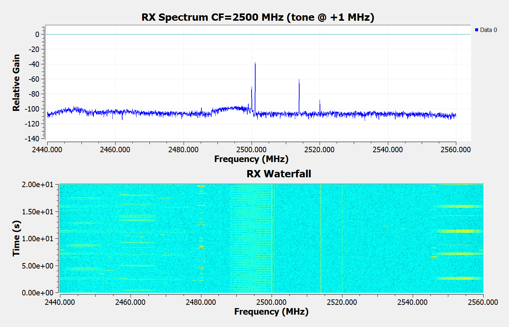

# VST Bridge 2.2 validation

Validated on 1 October 2026 (Europe/Helsinki), NI PXIe-5644R RIO0, Windows x64, Intel i7-6700, NI-RFSA/RFSG/FPGA Streaming for VST, radioconda GNU Radio 3.10.12.0, GQRX 2.17.6 and SoapySDR 0.8.1. The final UI rebuild embeds the same tested native module. Long runs were acquired before the final footer/theme change; binary identities are recorded separately.

## Ordinary GRC entrypoint: PASS

The canonical vst_bridge_120_duplex.grc generates vst_bridge_120_duplex.py. Acceptance launches that script's own normal main() in a separate process, as GRC does, without a flowgraph wrapper or GR_CONF_DEFAULT_BUFFER_SIZE environment setting. The graph displays actual Qt RX spectrum/waterfall and runs TX/RX at 120 MS/s.

Duration: 1,200.485 seconds. RX DMA: 120.001120 MS/s; RX delivered: 120.001120 MS/s; TX processed: 120.001129 MS/s. Zero TX underflows, RX active drops, display skips, FIFO overflows, recoveries, dropped logs or logger errors. Console has no Soapy sink error. Normal exit code is zero; RF is off after close and TX reports WAITING_CLIENT (No client data). 41 actual application captures were saved. This is the current golden GRC example.

Settings: center 2500 MHz, TX peak -10 dBm, RX reference -20 dBm, adjacent operator-supplied RF OUT/RF IN antennas. The measured RX tone peak is +996,093.75 Hz (8,192-point FFT bin spacing), about 68.3 dB above the median bin floor.

Raw evidence: [result](../tests/artifacts/grc-normal-2.2-20min/result.json), [monitor](../tests/artifacts/grc-normal-2.2-20min/monitor.jsonl), [console](../tests/artifacts/grc-normal-2.2-20min/console.log), [independent read-only IQ probe](../tests/artifacts/grc-normal-2.2-20min/tone-rx-probe.json). The probe does not consume or move the RX cursor.

## TDMS / GQRX acceptance

**USER_ACCEPTED: 1026.875 seconds (~17 minutes)**. The operator explicitly said “TDMS/GQRX 验收 完成吧，之前17分钟测试足够了” and cancelled the repeat. This is an accepted reference example, not a completed 1,200-second automatic PASS. The original interrupted result remains FAIL.

During the continuous RF-on interval: RX DMA/delivery 120.001127 MS/s; TX processed 120.001130 MS/s. No TX underflow, active RX drops, display skips, FIFO overflow, recovery or logger errors. External TXSTOP/live GNU Radio activation ended the original run. The valid interval ends at the last STREAMING/RF-on observation; the post-interruption end IQ probe is not used.

Four nominal 20 MHz DL FDD TM3.1a 256QAM carriers have offsets -30/-10/+10/+30 MHz, 30 kHz SCS and 51 PRB each. Each occupied width is 18.36 MHz; outer edges +/-39.18 MHz. TX peak -10 dBm; RX reference -20 dBm. Actual GQRX frame 0033 near the end was inspected: four separated occupied bands and a continuous waterfall.

The saved initial RF-on probe versus the pre-run RF-off probe gives the table below. All four band medians improve >10 dB. The -30 MHz carrier does **not** meet the stricter >=95% bin-coverage gate (65.142%); this gate is retained as FAIL. Operator acceptance does not relabel this measurement as PASS. These checks establish visibility, not RF conformance.

| Carrier offset / MHz | Initial median ON/OFF / dB | Bins improved >10 dB | Strict coverage gate |
|---:|---:|---:|---|
| -30 | 14.628 | 65.142% | FAIL |
| -10 | 25.816 | 100.000% | PASS |
| +10 | 29.931 | 99.725% | PASS |
| +30 | 29.580 | 97.896% | PASS |

Evidence: [explicit acceptance record](../tests/artifacts/gqrx-tdms-2.2-accepted17/result.json), [unchanged original FAIL](../tests/artifacts/gqrx-tdms-2.2-interrupted/result.json), [raw continuous observations](../tests/artifacts/gqrx-tdms-2.2-interrupted/monitor.jsonl), and original ON/OFF NPZ spectra. The cancelled repeat remains in tests/artifacts/gqrx-tdms-2.2-repeat-cancelled. GQRX requested FFT 16,384 / display 20 frames/s; real application grabs were saved every 30 seconds.

## Hardware regressions and UI

- TX 1/30.72/60/100/120 MS/s actual FPGA rates: PASS. A 64 MiB queue and 128 MiB DMA FIFO are applied and verified for each rate. Ceasing IQ writes and normal client close become WAITING_CLIENT with no error and RF off. [Evidence](../tests/artifacts/tx-controls-2.2/result.json).
- Delaying the first write by 1.2 seconds preserves PREFILLING and RF-off, then streams at 120 MS/s with no underflow. A write to an explicitly stopped Hub ring returns STREAM_ERROR. [Evidence](../tests/artifacts/tx-startup-2.2/result.json).
- TDMS TX alone, RX independent start/stop, RX reference retune with TX active, shared-rate-change rejection and TX stop preserving RX: PASS. [Evidence](../tests/artifacts/independence-2.2/result.json).
- Native/C# final build and 36 application self-tests: PASS. Existing 14 TDMS fixture results are retained; the reader is unchanged in 2.2.
- Exact scalar/SSE2 conversion equivalence: PASS across gains, unaligned input, odd tails, random data and special floats. Concurrent-host benchmark: scalar 182.6 versus SSE2 602.8 MS/s. A benchmark is not hardware acceptance.
- Final UI-only build: six actual WinForms pages rendered and inspected at default/minimum sizes on the 144-DPI host (12 images). Permanent RX/TX footer Start/Stop controls appear on every page; numeric controls and their dropdown lists/arrows use the dark theme. [Renders](../tests/artifacts/ui-footer-final-2.2/README.md). A short real-hardware independent RX/TX regression was repeated on this exact final executable: [result](../tests/artifacts/independence-footer-2.2/result.json).

## TIMEOUT investigation and measurement correction

The reported manual GRC run had already faulted at the Hub with depleted TX reserves; continuing writes could fill an orphaned shared-memory ring and report TIMEOUT. The old installed DLL matched the old build, so a mismatched plugin was not established as the cause. Evidence is retained in tests/artifacts/grc-manual-timeout.

2.2 separates GNU Radio activation from first scheduler data using a bounded 15-second initial prefill window, increases live FIFO reserve, replaces system-tick Sleep(1) with worker-owned high-resolution waits, and accelerates CF32 conversion with bit-exact SSE2. High-resolution waits alone did not prevent a development underflow; only the final tested combination is accepted. GNU Radio's set_thread_priority is unimplemented on this Windows build and is no longer relied upon. A true active-producer hardware fault remains FAULT; no-client data is idle and disables RF.

RX/TX workers publish counters independently at roughly half-second intervals. Rate calculations use each counter's own snapshot elapsed time; the 119.5–120.5 MS/s gate is unchanged. An earlier 60-second run failed when TCP observation time was incorrectly paired with older worker counters; its original FAIL result and [timing review](../tests/artifacts/grc-normal-2.1.1-sse-start1/TIMING-REVIEW.md) are preserved. [Superseded 2.1 validation](VALIDATION-2.1.md) describes the old wrapper-based result and its limitations.

## Capture provenance and binary identity

Windows native desktop capture returned FrameArrived timeout and cannot supply desktop photographs. GNU Radio uses its actual QWidget.grab(); Hub renders use DrawToBitmap. GQRX uses the acceptance-only capture build of upstream 2.17.6; RF/FFT/waterfall processing is unchanged, and the capture build is not installed or shipped as the product. [Capture provenance](../tests/GQRX-CAPTURE.md).

Long-run application/plugin/capture hashes: [2.2 binary identity](../tests/artifacts/release-binary-hashes-2.2.json). Results are bounded by this host, radio, software stack and antenna arrangement. 120 MS/s is complex IQ rate, not a flat 120 MHz analog passband. Spectrum visibility does not certify EVM/ACLR or absolute RF power.

Final UI executable identity and release scope: [review](../tests/artifacts/release-review-2.2.json), [final hashes](../tests/artifacts/release-ui-binary-hashes-2.2.json). The UI-only rebuild passed 36 self-tests and the hardware direction-control regression; no second long-duration measurement on this rebuilt executable is claimed. RF is off at delivery.
